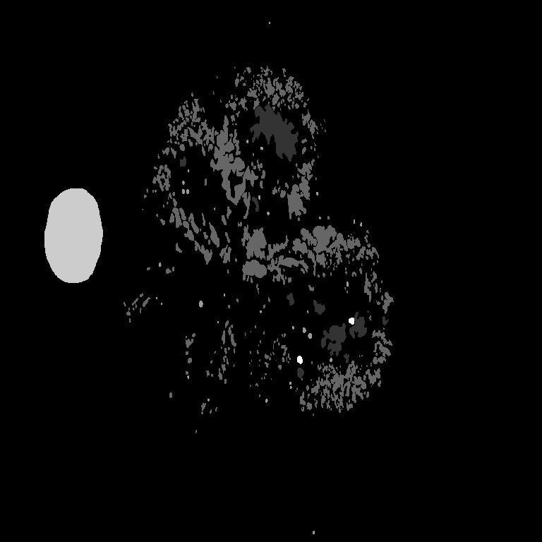
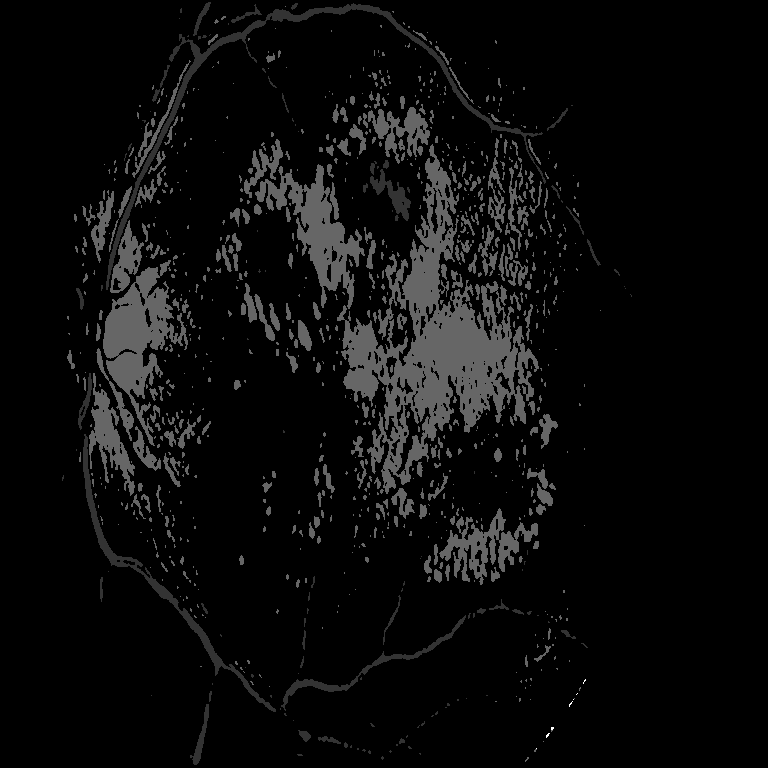

# Retinal Lesion Segmentation with Attention UNet

This repository contains a high-performance deep learning pipeline for multi-class segmentation of retinal lesions, specifically targeting signs of Diabetic Retinopathy.

## Overview

The project implements an **Attention-Gated Residual UNet (Att-ResUNet)**. This architecture is designed to accurately detect and outline five critical lesion types in retinal images, handling the extreme class imbalance and small object sizes (like microaneurysms) typical in medical imaging.

### Detected Lesion Classes:
1.  **Haemorrhages (HE)**
2.  **Hard Exudates (EX)**
3.  **Microaneurysms (MA)**
4.  **Optic Disc (OD)**
5.  **Soft Exudates (SE)**

## Architecture Features

-   **Residual Blocks**: Replaces standard convolutions to improve gradient flow and enable deeper feature extraction.
-   **Attention Gates**: Weights the skip connections based on coarse-scale feature signals, allowing the model to "focus" on relevant areas while suppressing background noise.
-   **Multi-Loss Strategy**: Combines **Focal Loss** (to handle class imbalance) and **Dice Loss** (to optimize spatial overlap).
-   **Mixed Precision**: Optimized for modern GPUs using `torch.cuda.amp` (FP16) for faster training and reduced VRAM usage.

## Results

Below is a sample from the validation set comparing the Ground Truth (original manual grading) and the Model's predicted segmentation.

| Ground Truth | Prediction |
| :---: | :---: |
|  |  |

*(Note: Grayscale intensity represents the class index 0-5).*

## Installation & Usage

1.  **Clone the Repository**:
    ```bash
    git clone https://github.com/Aryel0/Image_segmenation.git
    cd Image_segmenation
    ```
2.  **Requirements**:
    `torch`, `torchvision`, `albumentations`, `tqdm`, `Pillow`, `numpy`.
3.  **Training**:
    Specify your dataset directories in `train.py` or via CLI:
    ```bash
    python train.py --train_img_dir path/to/images --train_mask_dir path/to/masks --num_epochs 10 --batch_size 4
    ```

## Dataset

This implementation expects a directory structure compatible with the **IDRiD Dataset**:
-   `Original_Images/`: Contains RGB `.jpg` files.
-   `Segmentation_Groundtruths/`: Contains subdirectories for each lesion class (e.g., `Haemorrhages/`, `Hard Exudates/`) containing `.tif` binary masks.

---
*Created for the Deep Learning Practical course.*
